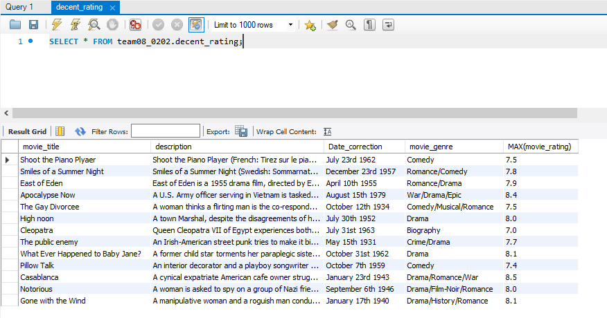
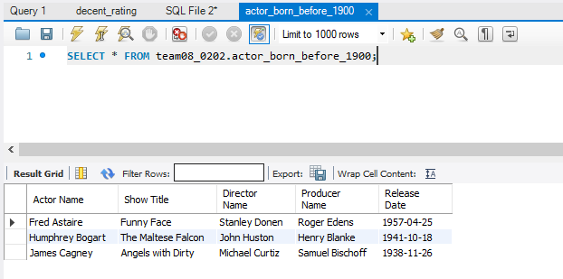
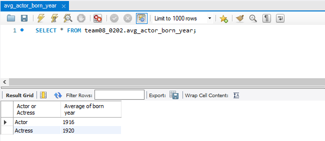
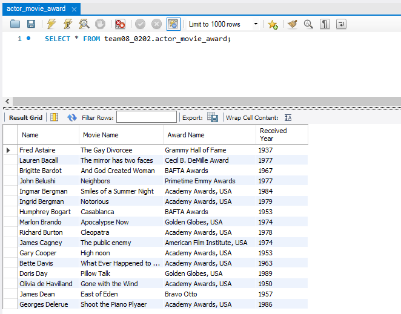
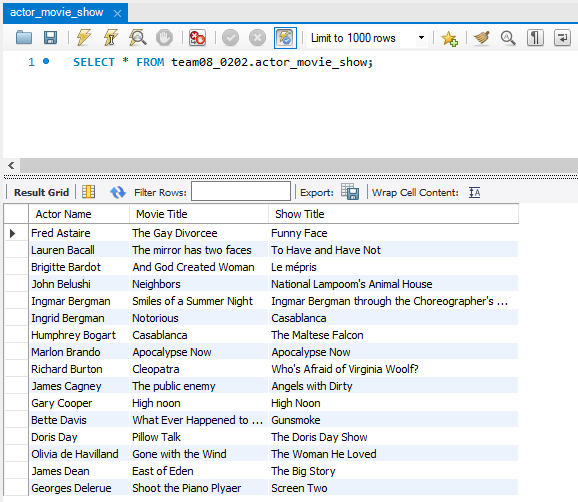

# Movie Database Design

## Project Introduction :hourglass:
IMDb is a real-life database project created by my team in the Database Design and Modeling course, based on SQL language. It contains information on movies and TV shows released since 2000, including the names of directors, producers, writers, creators, and actors, along with brief descriptions and release dates. We gathered data from the IMDb website and faced challenges in creating clear relationships between tables. To overcome these challenges, we communicated effectively using tools like GroupMe and Zoom, and I contributed to the project by designing the IMDb structure, creating queries, and designing and operating SQL to create the database and EER Diagram. This project helped me learn a lot about database design and management.


## EER Diagram :airplane:
In our ERD, we made seven tables, added the columns and specified our primary keys. Our tables have one-to-many relationships with one another, meaning an element from one table was linked to many elements of another. Take for example the relationship between the Movies table, Peoples table and People_type table. A movie involves many different people and types of people, i.e. directors, actors, producers. The Movie table is linked to many elements of the Peoples table as is the People_type table. The Peoples table, however, is only linked to one element from each of those tables and acts as a linking table between the two tables.


## Sample Data :passenger_ship:
Our ERD consists of seven tables with one-to-many relationships, meaning an element from one table is linked to many elements of another. For example, the Movies table is linked to the Peoples and People_type tables, which contain information about different people involved in making movies, such as directors, actors, and producers. The Peoples table acts as a linking table between the Movie and People_type tables, with each element linked to only one element from each of those tables.

## Views/Queries :vertical_traffic_light:
Query 1:
Create a view that shows movie_title,description,release date,movie genre and movie rating from movies table joined by movies_detailed table using movie_detailed_id. The query was filtered by WHERE clause, which was only showing the data that had movie rating more than 7.0, grouped by movie title. The view was called “decent_rating”.

```
use team08_0202;
DROP VIEW IF exists decent_rating;
use team08_0202;
CREATE VIEW decent_rating AS
SELECT movie_title,description,DATE_FORMAT(release_date,"%M %D %Y") AS
Date_correction,movie_genre,MAX(movie_rating)
FROM movies
JOIN movies_detail USING (movie_detail_id)
WHERE movie_rating >= 7.0
GROUP BY movie_title;
```




Query 2:
Create a view that shows Actor Name, Show Title, Director Name, Producer Name,
and Release Date. This query JOIN three tables. Those tables are peoples, television_show, and television_show_detail table. Also, this view only shows the actor whose born year is before 1900.

```
USE team08_0202;
CREATE OR REPLACE VIEW actor_born_before_1900
AS
SELECT
birth_name AS 'Actor Name',
show_title AS 'Show Title',
director_name AS 'Director Name',
producer_name AS 'Producer Name',
release_date AS 'Release Date'
FROM peoples p JOIN television_show ts ON p.show_id = ts.show_id
JOIN television_show_detail td ON ts.detail_id = td.show_detail_id
WHERE people_id IN (SELECT people_id FROM peoples where born_year < 1900);
```



Query 3:
Create a view that shows Actor or Actress and Average of born year. The purpose of
this view is to let users know what the average birth year is for actors or actresses in our database. In this query, we use GROUP BY to get two groups of actors. Then, we SELECT the born_year and use AVG and ROUND functions to get the Average of born year. We also use WHERE to filter those people who are not actors.

```
USE team08_0202;
CREATE OR REPLACE VIEW avg_actor_born_year
AS
SELECT actor AS 'Actor or Actress',
ROUND(AVG(born_year)) AS 'Average of born year'
FROM people_type pt JOIN peoples p USING(people_type_id)
WHERE actor IS NOT NULL
GROUP BY actor;
```



Query 4:
Create a view that shows Name, Movie Name, Award Name, and Received Year. This view will display the actors and their awards, and when they received the award. Also, let users know the movie name that the actor or actress acted in.

```
USE team08_0202;
CREATE OR REPLACE VIEW actor_movie_award
AS
SELECT birth_name AS 'Name',
movie_title AS 'Movie Name',
award_name AS 'Award Name',
date_received_year AS 'Received Year'
FROM peoples p JOIN movies m USING(movie_id)
JOIN awards a USING(people_id);
```



Query 5:
Create a view that shows Actor Name, Movie Title, and Show Title. This view will show the movie and show titles that the actor performed before. The relationship between Movies and Television_show is many to many because the Peoples table is a child table for both tables.

```
USE team08_0202;
CREATE OR REPLACE VIEW actor_movie_show
AS
SELECT birth_name AS 'Actor Name',
movie_title AS 'Movie Title',
show_title AS 'Show Title'
```

